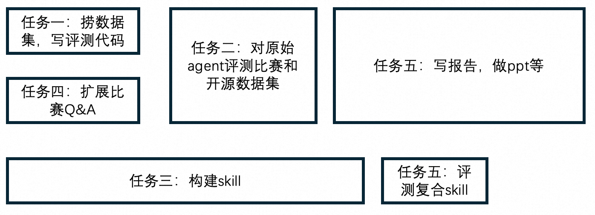

# 任务一

首先需要一个准确率评判机制，有两个常见数据集，Spider和BIRD，参考https://github.com/eosphoros-ai/Awesome-Text2SQL/blob/main/README.zh.md。其中，Spider常用评判标准是Exact Match(EM)和Exact Execution(EX)，后来慢慢开始常用Test Suite Accuracy。BIRD经常用Execution Accuracy (EX)和R-VES。

其中Test Suite Accuracy要用到多个数据库进行多次验证，这个我们应该是做不到的，我脑测了一下，可以看看到底能不能用。R-VES会考虑时间，对于复杂一点的text2sql skill，肯定是不太有利的，但是我们依然要收集，最后看情况酌情决定是否添加到报告中。

所以总结就是，我们需要Exact Match(EM)和Exact Execution(EX)和R-VES。对于Test Suite Accuracy，看一下评分机制和代码，看看到底有没有办法用上。

上面就是工作一：去看Spider和BIRD的数据集，先把这两个数据集捞过来，制作或者复用评分代码。然后再仿照着对本次比赛的数据集也写评分代码。我估计了一下，应该就是要输入2个sql，一个Q&A里的标准sql，一个生成的sql，然后对此进行多维度打分。交给agent应该可以比较快地搞定。评分代码放在workspace/standard中，数据集放在workspace/dataset里。

# 任务二

第二个任务是，我们先要看看在不细致搞的情况下，现在的ai能做到什么程度。先对本次比赛的数据集进行评测，看看得分。然后如果有必要的话，还要对Spider和BIRD进行评测。前者只要把sql代码生成出来即可，不急着立刻进行评分，所以可以和任务一并行。而后者则依赖于任务一，并且最好由同一个人进行，这样不需要商讨接口。

具体流程为：
* 在大文件夹下打开
* 不提供任何相关skill，直接问ai一个问题
* ai给出可执行sql语句
* 保存该语句，等待后续集中打分

其中第二步也可以通过把问题集中存放在一个文件里，让ai批量解答

考虑的原始解决方案包括：让不同强度的ai直接解答，比如：

* Fable（现在能用上吗）
* Claude
* GPT5.6
* Grok
* ds4 flash
* GLM5.2
* Kimi K3
* Qwen
* MiniMax
* MiMo
* hy

那么这里主要分成两个子任务：

* 对比赛数据集用不同模型生成sql
* 对Spider和BIRD用不同模型生成sql

并且需要爆金币，不过实际上不需要每个模型单独订阅，例如opencode go计划就几乎包含上面所有的模型。此外ds4flash新出了0731版，比pro厉害，所以不用评测ds4pro。并且上面的模型也不必全测，考虑到银行性质，重点评测国产模型，国外模型能测几个测几个。

# 任务三

核心任务，构建复杂的text2sql skill。我暂时的想法是，构建一个能自我进步和完备性的skill。具体来说，就是：

* 除了搭建skill框架和skill.md外，不做其它任何修改目录的事情
* 复合多个skill，通过skill来搭建知识库。针对每个表，由ai通过skill来构建初步知识库，然后通过多轮对话来完善该表知识库

这意味着至少需要以下skill：

1. 搭建知识库skill：根据skill.md，生成所需的空目录，使得结构形成
2. 访问数据库skill：通过多轮对话，获得通过代码访问数据库的能力，相关代码放在该skill目录下，并且要gitignore
3. 生成知识库skill：指定某个数据表，首先尝试通过2号skill访问该数据表。如果2号skill未完成，提示用户构建2号skill。在查看部分行后，查看该数据表的字段comment，如果未提供，向用户索取。完成上述两点后，生成初始知识库，然后与用户沟通，多次沟通后完善该知识库
4. 修改知识库skill：指定某个数据表，首先输出当前知识库总结。然后与用户多次沟通，确定修改细节后，与用户约定修改计划，然后修改知识库
5. text2sql skill：给定text，首先查看知识库，同时通过2号skill访问可能的数据表获取示例，然后生成sql语句。若当前text模糊不清，向用户询问。在完成解答后，将本次疑问和用户的解答存放到特定目录中。如果用户表示生成的sql错误，也记录起来
6. 完善知识库skill：对于5号skill中产生的疑惑，通常来源于agent无法理解text中的黑话，因此本skill读取产生的疑问和解答以及错误，完善知识库的理解，添加别名、黑话等到知识库中。

暂定目录：
* workspace/.knowledge/architecture：存放每个数据表的知识
* workspace/.knowledge/conventions：存放别名、黑话，错误改正等内容
* workspace/.knowledge/troubleshooting：存放疑惑、错误

看起来工作量很大，其实可能也就这样，主要还是让agent来做。

# 任务四

目前比赛提供的Q&A太少了，需要由一个人与agent交流，多生成一些问题和sql。这就要求这个人要懂sql。这一步也是可以和任务一并行的

# 任务五

收尾，把任务三的skill进行评测，然后制作报告，ppt等。事实上这一步需要的人手可能反而最多。

按时间顺序，流程如上图所示

现在全做完了，我们完整地回顾一下，看看有没有漏的，我说的不一定全，主要看我说的有没有被漏掉：
1、1号skill，检查.knowledge目录结构是否完备；是否指定了6号skill自动检查，如果没有，那么询问是否开启自动模式
2、提供给新用户一个推荐路径：标准初始化路径：先创建knowledge目录，然后配置读取数据表的方式，然后配置知识库，可选配置自动消化，都完成就可以开始询问了
3、提供快速路径：用户只需要提供读取数据表的方式，再提供一个表的信息文件或目录，你可以自行完成初始化和构建知识库。这种情况下不会自动消化troubleshooting